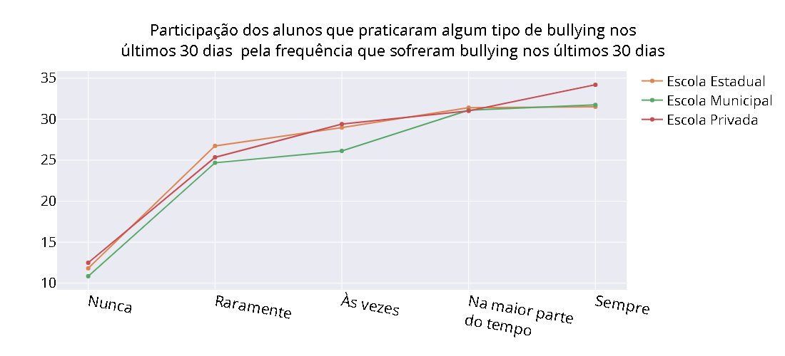

# Perspectivas do bullying no Brasil

Este trabalho tem o objetivo de trazer reflexões sobre o bullying e de seus efeitos em alunos do 9º ano (antiga 8ª série) do ensino fundamental no Brasil.

  

      
  

  
Foi utilizada a base de dados PeNSE (Pesquisa Nacional de Saúde Escolar); esta base investiga informações que permitem conhecer e dimensionar os fatores de risco e proteção à saúde dos adolescentes. A pesquisa é realizada por amostragem, utilizando como referência para seleção o cadastro das escolas públicas e privadas do Instituto Nacional de Estudos e Pesquisas Educacionais Anísio Teixeira - INEP.  

A base está disponível em: https://www.ibge.gov.br/estatisticas/downloads-estatisticas.html?caminho=pense/2015/microdados/  

Escavar a base PeNSE, do ano de 2015, onde foram pesquisados mais de 100 mil alunos do 9º ano, distribuídos em todo território nacional de escolas privadas e públicas, e se deparar com algumas informações foi preocupante, para dizer o mínimo.

O estudo completo pode ser visto no arquivo notebook. As principais conclusões estão descritas a seguir.

## Distribuição da base PeNSE 2015

A base de dados PeNSE 2015 está distribuída de maneira bastante próxima às quantidades de matrículas do 9º ano, por tipo de escola, segundo o censo escolar 2015:

  
|Escola  |Quant. de alunos da amostra|Porcentagem da amostra|Censo escolar 2015|
|--------:|:------:|:-----:|:----:|
|Estadual |49462 |48.5 |48.9|
|Municipal|31404 |30.8 |36.4|
|Privada  |20918 |20.5 |14.6|
|Federal  |288   |0.3	|0.2 |
  

## Para cada aluno que pratica bullying, há cerca de dois alunos e meio que assumem sofrer bullying

Pela pergunta "NOS ÚLTIMOS 30 DIAS, com que frequência algum dos seus colegas de escola te esculacharam, zoaram, mangaram, intimidaram ou caçoaram tanto que você ficou magoado, incomodado, aborrecido, ofendido ou humilhado?", nota-se que aproximadamente 50% dos alunos sofreram, pelo menos uma vez nos últimos 30 dias, algum tipo de bullying:

  
|Resposta (%)|Federal|Estadual|Municipal|Privada|
|--------:|:----:|:-----:|:----:|:----:|
|Nunca|50.35|55.86|56.16|53.41|
|Raramente|26.39|21.06|20.40|25.87|
|Às vezes|14.24|15.40|16.33|14.34|
|Na maior parte do tempo|4.17|3.87|3.36|3.78|
Sempre|4.86|3.14|3.14|2.40|
Não informado|0.00|0.68|0.61|0.19|

  
E pela pergunta "NOS ÚLTIMOS 30 DIAS, você esculachou, zombou, mangou, intimidou ou caçoou algum de seus colegas da escola tanto que ele ficou magoado, aborrecido, ofendido ou humilhado?" nota-se que aproximadamente 20% dos alunos admitem terem praticado algum tipo de bullying, pelo menos uma vez nos últimos 30 dias.

  
|Resposta (%)|Federal|Estadual|Municipal|Privada|
|--------:|:----:|:-----:|:----:|:----:|
|Sim|22.92|18.95|17.47|19.48|
|Não|76.74|80.49|82.04|80.31|
|Não informado|0.35|0.56|0.49|0.21|

## Não parece haver qualquer diferença entre os tipos de escola e a realidade do bullying presenciado em suas dependências

Pergunta aos alunos: Você já sofreu bullying?

|Resposta (%)|Federal|Estadual|Municipal|Privada|
|--------:|:----:|:-----:|:----:|:----:|
|Sim|52.08|47.77|47.18|45.53|
|Não|47.57|50.06|50.18|53.50|
|Não sei o que é bullying|0.35|1.71|2.25|0.75|
|Não informado|0.00|0.45|0.40|0.22|

## Quanto mais frequente o aluno é vítima de bullying, mais provável que também pratique o mesmo com outro(s) colega(s)
Este e os demais gráficos apresentam um recorte de uma subamostra específica (no caso abaixo, considerando apenas os alunos que admitiram ter praticado bullying nos últimos 30 dias) e verifica-se qual é a participação desses alunos quanto a resposta de cada uma das alternativas listadas no eixo X para a pergunta a respeito se já sofreram bullying. 

Exemplo de leitura: "aproximadamente 11% dos alunos que admitem ter praticado bullying também responderam que 'nunca' sofreram bullying nos últimos 30 dias, enquanto que para aqueles que alegam 'sempre' sofrerem bullying nos últimos 30 dias, este percentual é mais de 30%."

É possível, ainda, complementar a leitura: "os outros quase 90% dos alunos que 'nunca' sofreram bullying nos últimos 30 dias, também não praticaram com seus colegas, enquanto que menos de 70% dos alunos que 'sempre' sofreram bullying nos últimos 30 dias deixaram de praticar com seus colegas."

Repare, portanto, que o somatório dessas porcentagens apresentadas no gráfico não dará 100%, necessariamente.

   

## Quanto mais frequente o aluno é vítima de bullying, há maiores chances de possuir menos amigos próximos e mais sozinhos se sentem

  
  

  
  
  
  

## Quanto mais frequente o aluno envolve-se em brigas físicas, mais provável é que pratique ou que sofra bullying

  
  
  
 
  
  

## Quanto mais frequente o aluno é vítima de bullying, aumenta-se as chances de não dormir direito;

  
  
  

## Percepção dos alunos quanto ao combate ao bullying nas escolas

Embora a maior parte das escolas apresente alguma política contrária à prática de bullying, não há diferenças* na percepção de bullying pelos alunos que frequentam escolas que apresentam ou que não apresentam tal política, como pode ser visto nas duas tabelas a seguir:

- Considerando apenas a matrícula de alunos que alegaram ter sofrido bullying com alta frequência ('sempre') nos últimos 30 dias, compila-se a respostas do(a) diretor(a), coordernador(a) ou responsável pela escola para a pergunta: a escola tem alguma política, norma ou regra escrita que proíba bullying nas suas dependências?

|Resposta (%)|Federal|Estadual|Municipal|Privada|
|--------:|:----:|:-----:|:----:|:----:|
|Dados não disponíveis|0.00|0.19|0.00|0.00|
|Sim|64.29|88.02|87.83|93.64|
|Não|35.71|11.66|12.17|5.96|
|Não informado|0.00|0.13|0.00|0.40|

- Considerando apenas a matrícula de alunos que alegaram não ter sofrido bullying ('nunca') nos últimos 30 dias, compila-se as respostas do(a) diretor(a), coordernador(a) ou responsável pela escola para a  pergunta: a escola tem alguma política, norma ou regra escrita que proíba bullying nas suas dependências?

|Resposta (%)|Federal|Estadual|Municipal|Privada|
|--------:|:----:|:-----:|:----:|:----:|
|Dados não disponíveis|0.00|0.14|0.00|0.36|
|Sim|91.72|88.24|85.35|93.09|
|Não|8.28|11.55|14.53|6.19|
|Não informado|0.00|0.07|0.12|0.36|

 * a diferença observada para as escolas federais pode ser devido à reduzida quantidade de respostas disponíveis na base PeNSE 2015. 

Levanta-se a hipótese que o resultado da política contrária ao bullying, existente nas escolas onde estudam cerca de 90% dos alunos que fizeram parte do estudo, seja ineficaz.

## Considerações finais
Foi verificado que vítimas de bullying tendem a ser praticantes de bullying, reforçando o ciclo problemático, muitas vez com brigas físicas.
Também constatou-se que as vítimas de bullying apresentam maior sensação de solidão e piora na qualidade do sono.
É dever de todo educador, seja atuante em escolas ou sendo pai/mãe quebrar este ciclo que é tão destrutivo para crianças e jovens.
Se notar algum comportamente estranho, é sinal de que algo pode estar errado no núcleo social do educando.
Procurar ajuda junto a escola e profissionais da saúde mental é fundamental.

  

### Referências

  • [Conteúdo sobre bullying e fonte da primeira imagem](http://www.justificando.com/2017/10/20/ja-passou-da-hora-de-reconhecer-que-o-bullying-existe-e-danoso-e-nao-pode-ser-admitido/)  
  • [Mais conteúdo sobre bullying e fonte da última imagem](https://amenteemaravilhosa.com.br/ferida-emocional-bullying-na-escola/)
